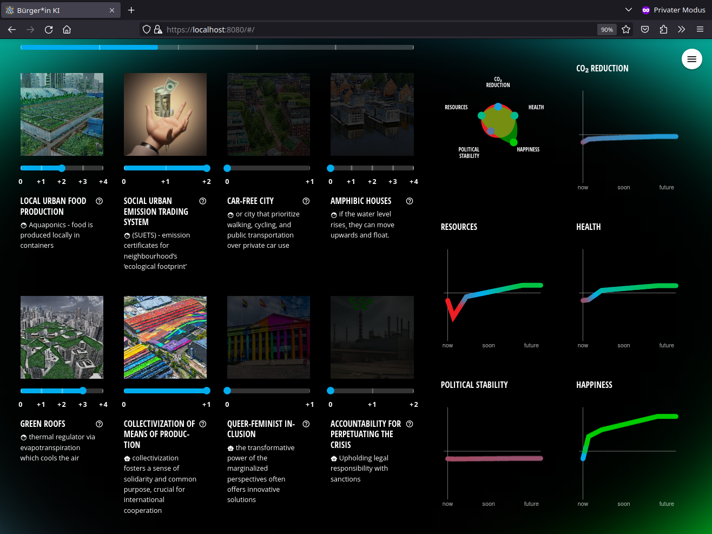

# Citizen A.I. (bki-frontend)

Dashboard for a gamified resource planning art performance.
Performed at City Climate meets Creative Coding festival, Hamburg, 2023.
<https://www.creativecoding.city/citizen-ai>



Built with Vue, [Quasar](https://v1.quasar.dev/) and [Chart.js](https://www.chartjs.org/), it lets you adjust inputs, sends that to [Urban Model Platform](https://github.com/citysciencelab/urban-model-platform) and displays the results in nice charts.

* Meant to be run full screen, kiosk mode
* Supports a 4k viewport
* Developed for touch interfaces, so not much hover.
  Click the "inputs" to reveal a sidebar with more information.
* The reactive, animated *meshy* background gradient
  requires a powerful machine to look smooth,
  especially on 4k.

## Set up & run

You'll need Node.js, version 16 should work, others might.

The production API is down at the moment, so we'll use the mock API.

```bash
# install deps
yarn

# run dev server with HMR
make run-quasar-api-mock

# build
make build-quasar

# deploy
# create an .env file, check Makefile vor vars
make rsync-dry
make rsync-wet
# or
make lftp-dry
# etc.
```

## Credits

This dashboard is a part of a bigger project.

Frontend code + UI/UX: [Jakob Wierzba](http://jakobwierzba.de/).

Project concept:
[Birk Schmithüsen](https://birkschmithuesen.com),
[Mikala Hyldig Dal](https://cargocollective.com/mikala-hyldig-dal),
[Nina Maria Stemberger / ArtesMobiles](https://artesmobiles.art)

System Dynamics: Rico Herzog

Climate Scientist: Gaby Langendijk

## License

Text and graphics contents: Public Domain / [CC-0](https://creativecommons.org/public-domain/cc0/).

Code: "MIT", Copyright © 2023 Jakob Wierzba, see file LICENSE
